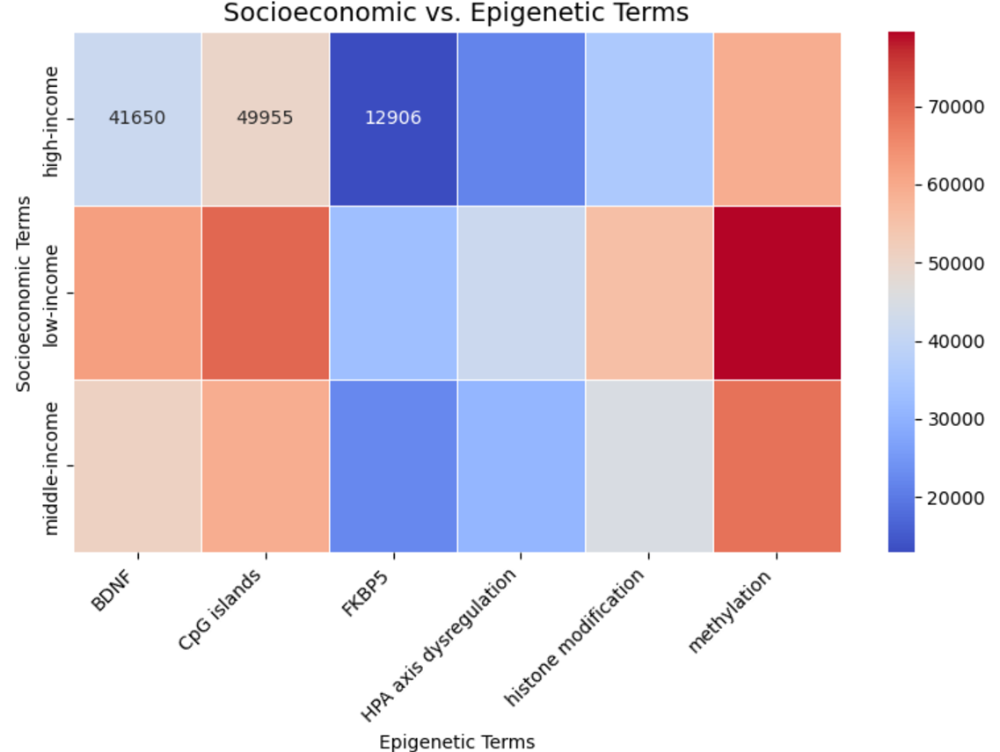
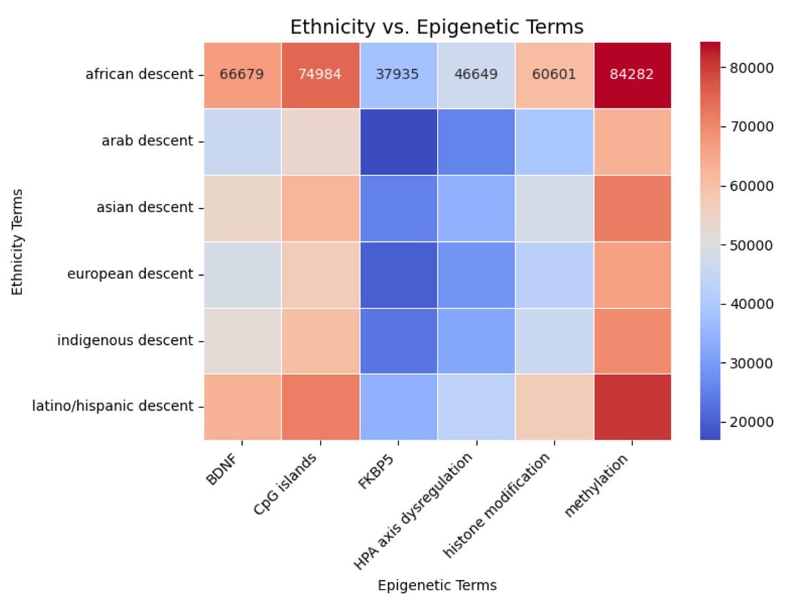

# Epigenomic Impact of Social Trauma (NLP Meta-Analysis)

An end-to-end NLP pipeline that expands domain terms, fetches biomedical papers, preprocesses PDFs, and produces an interactive Dash dashboard (heatmaps + 3D scatter) to explore relationships between **social trauma**, **mental health**, **socioeconomic/ethnographic factors**, and **epigenetic markers**.

## Demo

### Interactive dashboard (local)
- Run the dashboard: `python scripts/myvisuals.py`
- Opens at: `http://127.0.0.1:8050/`

### Example heatmaps

<p align="center">
  
  
  
</p>
<p align="center"><i>Heatmaps highlighting cross-category associations (e.g., socioeconomic ↔ epigenetic, ethnicity ↔ epigenetic, mental health ↔ epigenetic).</i></p>

---

## Features
- **Term expansion** from seed concepts using semantic similarity + Wikipedia traversal (`expand_terms.py`)
- **Paper retrieval** via Google Scholar scraping (PyPaperBot) using dynamically generated multi-category queries (`fetch.py`)
- **PDF preprocessing** (PyMuPDF + spaCy transformer model):
  - robust text extraction + cleaning
  - lemmatization + stopword removal
  - NORP entity extraction (demographic mentions)
  - category-level term counting (`process.py`)
- **Modeling / categorization** with parallelism + Hugging Face zero-shot classification (`modeling.py`)
- **Dash dashboard** with:
  - 3 heatmaps
  - simplified 3D scatter plot for top associations (`myvisuals.py`)
- **Unit tests** for key components (`scripts/tests/`)

---

## Tech Stack
- **Python 3.10+**
- NLP: **spaCy** (`en_core_web_trf`), **NLTK**, **Hugging Face Transformers** (`facebook/bart-large-mnli`)
- Term expansion: **SentenceTransformers**, **Wikipedia API**
- PDFs: **PyMuPDF (fitz)**
- Viz: **Dash**, **Plotly**, **Seaborn**, **Matplotlib**, **Pandas**
- Fetching: **PyPaperBot** (via subprocess)

---

## Architecture

### High-level pipeline
1. `scripts/expand_terms.py` → builds `expanded_terms.json` (seed terms → expanded vocabulary)
2. *(optional)* `scripts/fetch.py` → downloads PDFs into `data/papers/` using expanded term queries
3. `scripts/process.py` → reads PDFs + `expanded_terms.json`, outputs `preprocessed_articles.json`
4. `scripts/modeling.py` → reads `preprocessed_articles.json`, outputs `scripts/json/final_modeling.json`
5. `scripts/myvisuals.py` → loads `scripts/json/final_modeling.json`, serves Dash app

### Project layout
- `data/`
  - `papers/` — PDF corpus (downloaded or manually added)
- `scripts/`
  - `expand_terms.py` — builds expanded vocabulary for querying
  - `fetch.py` — generates query + downloads papers with PyPaperBot
  - `process.py` — PDF → cleaned text + categorized term counts
  - `modeling.py` — term categorization + enrichment (zero-shot) + parallel processing
  - `myvisuals.py` — Dash UI (heatmaps + 3D scatter)
  - `mock_visuals.py` — toy dashboard using mock counts (fast demo)
  - `run_modeling.py` — legacy demo runner (may contain machine-specific paths)
  - `tests/` — unit tests for expansion/modeling/visuals
  - `json/` — intermediate files used by scripts (e.g., `final_modeling.json`)
- `requirements.txt`

---

## Getting Started

> Run all commands from the **project root**.

### 1) Install dependencies
```bash
python -m venv .venv
# mac/linux
source .venv/bin/activate
# windows (powershell)
# .\.venv\Scripts\Activate.ps1

pip install -r requirements.txt
python -m spacy download en_core_web_trf
```
### 2) Generate expanded terms
Creates expanded_terms.json in the project root.
```bash
python scripts/expand_terms.py
```
### 3) (Optional) Fetch papers
fetch.py expects the expanded terms file at ./scripts/json/expanded_terms.json.
```bash
mkdir -p scripts/json

# mac/linux
cp expanded_terms.json scripts/json/expanded_terms.json
# windows (cmd)
# copy expanded_terms.json scripts\json\expanded_terms.json

python scripts/fetch.py
# downloads PDFs into: data/papers/
```
If you skip fetching, just place PDFs manually in:
```Plain text
data/papers/
```
### 4) Preprocess PDFs
Reads from data/papers/ and writes preprocessed_articles.json:
```bash
python scripts/process.py
```
### 5) Run modeling + create the file used by the dashboard
myvisuals.py loads: ./scripts/json/final_modeling.json, so generate it here:
```bash
mkdir -p scripts/json

python -c "from scripts.modeling import process_articles; process_articles('preprocessed_articles.json','scripts/json/final_modeling.json')"
```
### 6) Launch the dashboard
```bash
python scripts/myvisuals.py
# open http://127.0.0.1:8050/
```
### Fast demo (no pipeline)
If you just want to see the dashboard UI instantly:
```bash
python scripts/mock_visuals.py
# open http://127.0.0.1:8051/
```

## Running Tests
Run the whole suite:
```bash
python -m unittest discover -s scripts/tests -p "test_*.py"
```
Or individually:
```bash
python -m unittest scripts/tests/test_expand_terms.py
python -m unittest scripts/tests/test_modeling.py
python -m unittest scripts/tests/test_visuals.py
```

## Notes / Caveats:
- First run can take longer because:
   - spaCy downloads/loads a transformer model (en_core_web_trf)
   - Transformers downloads facebook/bart-large-mnli for zero-shot classification
   - NLTK downloads tokenizer data (punkt)
- scripts/run_modeling.py contains a hardcoded NLTK path from the original class environment; prefer the process_articles(...) command shown above.
- This project is for research exploration/visual analysis and does not imply causal medical conclusions.

## Team
- Majd Aldaye — term expansion + fetching + preprocessing + testing framework
- Maya Murry —  modeling pipeline integration + visualization development + debugging

